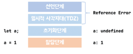
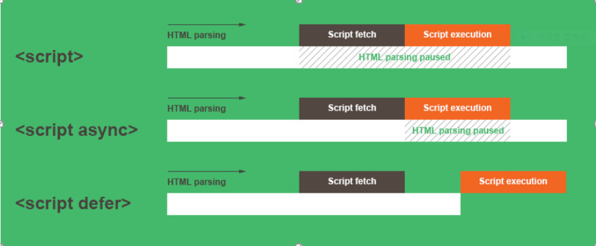

## 자바스크립트 엔진

> 자바스크립트 엔진은 자바스크립트 코드를 실행하는 프로그램 혹은 인터프리터를 말한다. <br>
> V8은 웹 프라우저를 만드는데 기반을 제공하는 오픈소스 자바 스크립트 엔진이다. <br>
> ECMAScript 규격의 C++로 작성되었으며, 자바스크립트를 바이트코드로 컴파일하고 실행하는 방식을 사용한다.

<br>

## 자바스크립트 코딩 규약

> - 들여쓰기를 할 때는 공백 2개를 사용한다.
> - 문자열에는 작은따옴표를 사용한다.
> - 사용하지 않는 변수는 정의하지 않는다.
> - 예약어 뒤에는 공백을 추가한다.
> - 함수 선언 괄호 앞에 공백을 추가 한다.
> - 공백 사이에 연산자를 넣어준다.
> - 쉼표 뒤에 공백이 있어야 한다.
> - else 구문은 중괄호와 같은 줄에 둬야한다.
> - 여러 줄의 if 구문을 사용할 경우 중괄호를 사용해야 한다.
> - 함수에 매개변수 err가 있을 경우 항상 처리해야 한다.
> - 브라우저 전역 접두어인 window를 붙여야 한다. 다만, document, console, navigator를 사용할 경우 생략이 가능하다.
> - 여러줄의 공백을 허용하지 않는다.
> - var 선언의 경우 하나씩 선언해야 한다.
> - 조건부 할당은 추가적으로 괄호로 묶는다.
> - 한 줄을 중괄호로 처리할 경우 공백을 추가한다.
> - 변수와 함수 이름에는 카멜케이스를 사용한다.
> - eval()을 사용하지 않는다. <br>
>   "JavaScript standard Code Style 공식문서" <br>
>   참조> https://standardjs.com/rules-kokr.html

<br>

## 명명표기법

: 자바스크립트에서는 주로 카멜표기법과 파스칼 표기법을 사용한다.

1. 명명표기법 : 명명규칙을 의미한다.
2. 식별자의 명칭은 프로젝트, 프로그래밍언어, 개발도구 등에 따라 다를 수 있다.
3. 명명 표기법을 따르는 목적은 가독성, 효율성을 높이기 위해서다.
4. 대표적인 표기법 종류 : 헝가리안 표기법, 카멜 표기법, 파스칼 표기법, 스네이크 표기법
   <br>

   ### 헝가리안 표기법 (Hungarian Notation)

   : 데이터 종류 등의 약어를 이름 앞에 붙여 표기해주는 방법 <br>
   : boolean - b - bCheck <br>
   : char - c - cData <br>
   : String - s - sName

   ### 카멜 표기법 (Camel Notation)

   : 이름의 시작은 소문자, 두번째 단어부터는 그 단어의 시작글자만 대문자로 표기하는 방법. 표기법이 낙타(카멜)의 모양과 비슷하여 카멜표기법이라 한다. <br>
   : valueChanged <br>
   : appDomain

   ### 파스칼 표기법 (Pascal Notation)

   : 모든 단어의 첫 글자를 대문자로 표기하는 방법 <br>
   : ValueChanged <br>
   : AppDomain

   ### 스네이크 표기법 (Snake Notation)

   : 단어간의 연결을 언더바(\_)로 표기하는 방법 <br>
   : value_changed <br>
   : app_domain

   ##### 참조> https://msdn.microsoft.com/ko-kr/library/ms229043(VS.80).aspx

---

## 호이스팅(Hoisting)이란?

: 자바스크립트는 실행될 떄 모든 선언(var, let, function, class)을 호이스팅 한다. <br>
: 변수나 함수 선언들은 모두 끌어올려서 해당 함수 유효 범위의 최상단에 선언하는 개념이다. <br>
: 함수선언문으로 정의된 함수는 실행되는 시점에 함수선언, 초기화, 할당이 한번에 이루어진다. 그렇기 때문에 함수 호이스팅이 발생해서 유효범위 내의 어느곳에서도 호출이 가능하다. <br>
: 함수표현식으로 정의된 함수는 함수 호이스팅이 아닌 변수 호이스팅이 발생하기 때문에 유호범위 내에 있더라도 함수 호이스팅이 발생하지 않아서 함수표현식으로 작성할 경우에는 사용할 곳보다 위에서 작성하는 것이 필수적이다.
<br>
<br>

### 호이스팅 대상

- JS에선 변수가 사용된 이후 선언 가능. 즉, 변수 선언 전에 변수 사용이 가능하다.
- 호이스팅 되는 건 오직 변수 선언 자체일 뿐, 초기 변수값은 hoisting 안된다.
- var 키워드로 선언된 변수는 hoisting 가능하지만, let과 const 키워드 선언된 변수 또는 함수표현식으로 hoisting 안된다.
- 호이스팅 작동 원리 이해 못하면 에러 발생의 원인이 되므로 모든 변수 선언은 코드 경계 범위의 최상단에 한다.
- JS 엄격모드에선 hoisting 사용 불가하므로 미리 선언 안 된 변수는 사용 불가능하다.

> - var키워드로 선언한 변수는 런타임 이전에 선언 단계와 초기화 단계가 같이 실행된다.
> - let, const 키워드는 선언한 변수는 선언단계와 초기화 단계가 분리되어 진행된다.
> - 해당코드가 실행되기 전까지는 초기화가 되지 않아 일시적 사각지대에 빠져 호이스팅이 일어나지 않는 것처럼 보인다. (Reference Errer)
>   

### Hoisting (Reference Error)

: 원칙적으로는 let을 선언해도 hoisting이 발생함, hoisting 이 발생되지 않았으면 결과값이 1로 나와야 함 <br>
: 초기화단계로 가기전에 '일시적 사각지대'에 빠져있는 상태이기때문에 접근할수 없는 상태가 되어 있는 것 <br>

```javascript
let bar = 1;
{
  console.log(bar);
  // Uncaught ReferenceError: Cannot access 'bar' before initialization
  let bar = 2;
}
```

---

### 외부 스크립트 불러오기

: 외부스크립트를 가져올때 위에서 부터 읽어내려가는 컴퓨터의 특성 상 html보다 script가 먼저 실행됨으로써 생기는 오류를 막기위해서 defer 를 입력 <br>
: 현재 방식

```html
<script defer type="text/javascript" src="js/b.js"></script>
```


<br>

---

### 자바스크립트 주석처리 방법

```javascript
// 한줄 주석
/* 여러줄 주석 */
```

### 자바스크립트 출력기호

- 출력기호 : `%d(숫자)`, `%f(실수)`, `%b(논리)`, `%c(문자)`, `%s(문자열)` ``(백틱) 주의
- %s(문자열)을 사용 : 자바에서는 문자와 문자열을 구분하지만 자바스크립트에서는 구분하지 않음 %c(문자) : js는 지원하지않음
- ${} : 자바스크립트 논리값 출력
  <br>

---

## 변수 선언 규칙

- 첫 글자는 숫자 포함 불가 ('123', '1st' 등 불가)
- 첫 글자 이후의 글자는 숫자도 포함 가능 ('no1', 'dec2hex' 등 가능)
- 특수기호는 $와 \_만 가능 ('hi?', 'my-name' 등 불가)
- 대소문자를 구분 ('nama'와 'Nama'는 서로 다른 변수)
- 'var'등의 자바스크립트 내부 키워드는 사용 불가
  <br>

### 변수 선언자 (var, let, const)

- var는 function-scoped이고 let, const는 ES2015(ES6)에서 추가된 block-scoped 이다.
- var는 변수 재선언 가능. let, const는 변수 재선언 불가능이다.
- let은 mutable이고 const는 immutable 이다.
- var는 function-scoped로 hoisting이 되고, let과 const는 block-scoped 단위로 hoisting이 된다.
  <br>

### 변수 선언 3단계

1단계 선언(Declaration) <br>
: 변수를 선언하여 자바스크립트 엔진에 변수를 알린다. 즉 내부적으로 실행 컨텍스트가 생성되고 그 안에서 관리하게 된다.

2단계 초기화(Initializtion) <br>
: 변수값을 저장하기 위한 메모리 공간을 확보하고 값을 undefined로 초기화한다.

3단계 할당 <br>
: undefined로 초기화 된 변수에 실제 값을 할당한다.
<br>
<br>

### 변수의 스코프(scope) (var와 let)

- var는 변수가 사용되는 범위가 전역, 함수 내부 로컬 2가지만 가능하다.
- let은 변수가 사용되는 범위 전역, 함수 내부 로컬, 코드 블록, 표현식 로컬드의 정의에 사용할 수 있다.

```javascript
// var로 선언한 변수는 현재 함수 밖에서도 사용 가능하다.
for (var i = 1; i < 3; i++) {
  console.log(`i=${i}`);
}
console.log(`i=${i}`);
//-----------------------------//
//let으로 선언한 변수는 현재 함수 내부에서만 사용 가능하다. (현재 권장 사항)
for (let j = 1; j < 3; j++) {
  console.log(`j=${j}`);
}
console.log(`j=${j}`);
// Uncaught ReferenceError: j is not defined
```

### 함수선언문과 함수표현식

```javascript
//함수선언문
function process() {
  console.log(`process`);
}
//함수표현식
var display = function () {
  console.log(`display`);
};
```

---

### 데이터 타입 (DataType)

- datatype : primitive datatype(기본 데이터 타입), refernce datatype(참조데이터 타입)
- string : 문자열
- number : 숫자
- boolean : 논리값
- object : 오브젝트
- function : 함수

```javascript
//number (숫자)
let num = 3;
typeof num;
console.log(typeof num);

//string (문자) : 출력은 3이지만 "(따옴표)"로 묶으면 문자, 묶지 않으면 숫자. 주의할것.
let num = "3";
console.log(typeof num);
console.log(num);

//boolean (논리값)
let check = true;
console.log(`check=${check}, ${typeof check}`);

//string (문자열)
let data = "javascript";
console.log(`data=${data}, ${typeof data}`);

//object (오브젝트)
let name = null;
console.log(`name=${name}, ${typeof name}`);

//function (함수)
//변수의 값으로 사용되는 함수는 익명함수로 정의한다.
let fn = function () {
  console.log(`function`);
};
console.log(`fn=${fn}, ${typeof fn}`);
```

---

### 연산자 (operator)

- 연산자 : 계산에 사용되는 기호 (+, -, \*, /, %, <, > )
- 피연산자 : 계산에 사용되는 값 (숫자)
- 산술연산자 : +, -, /, \*, %, ++(증가), --(감소)
- 논리연산자 : && (AND), || (OR), ! (NOT)
- 비교연산자: >, <, >=, <=, ==, !=, ===, !==
  - == : 메모리에 저장된 값만 비교 <br>
  - === : 메모리에 저장된 값과 데이터 타입 비교
- 조건연산자 : 조건식 ? true : false
  - ~ : 조건식 ? (조건식 : true1 : false1) : false
- 대입연산자

```javascript
//---산술연산자---//
let numX = 3;
let numY = 4;
let sum = numX + numY;
console.log(`sum${sum}`);
console.log(`numX-numY=${numX - numY}`); //numX-numY=-1
console.log(`numX*numY=${numX * numY}`); //numX*numY=12
console.log(`numX/numY=${numX / numY}`); //numX/numY=0.75
console.log(`numX%numY=${numX % numY}`); //numX%numY=3  //나눌수가 없어서 아예 나누지를 않음.
console.log(`numX%numY=${parseInt(numX) % parseInt(numY)}`); //numX%numY=3
//parseInt : 문자열로 나타나있는 숫자를 정수값으로 바꿔주는 명령어
console.log(numX % numY); //3

//연산자 위치에 따라서 출력값이 다를 수 있음
console.log(`numX=${++numX}`); //numX=4  증가 후 출력 1+3=4
console.log(`numX=${numX++}`); //numX=4  출력 후 증가 4 출력 후 +1 = 5
console.log(`numX=${numX}`); //numX=5  이전에 증가 된 5가 출력
console.log(`numY=${numY ** 2}`); //numY=16

//---논리연산자---//
let a = 3;
let b = 5;
let c = 9;
// &&(AND)는 좌변이 false면 우변을 수행 안한다.
let count = b < a && ++c > 4;
console.log(`count=${count}, c=${c}`); //count=false, c=9
// ||(OR)은 좌변이 true이면 우변을 수행 안한다.
count = b > a || ++c > 4;
console.log(`count=${count}, c=${c}`); //count=true, c=9

//---비교연산자---//
let numX = 5;
let numY = 5;
console.log(`numX==numY:${numX == numY}`); //numX==numY:true
console.log(`numX===numY:${numX === numY}`); //numX===numY:true

let objX = new Number(numX);
let objY = new Number(numY);
console.log(`objX==objY:${objX == objY}`); //objX==objY:false
console.log(`objX===objy:${objX === objY}`); //objX===objY:false

//---조건연산자---//
// : 회원이고 VIP이면 : 30%, 회원이고 일반이면: 20%, 비회원 : 2%
let member = true;
let glade = "general";
let count = 1000;

let res = member ? (glade == "VIP" ? 0.3 : 0.2) : 0.02;
console.log(res * count);

//---대입연산자---//
let data = 0;
data = data + a;
data += a; //+= 연산자 사이에 공백이 생기거나 순서가 바뀌면 안됨
console.log(`data=${data}`);
```

### 연산자 우선순위

: 단항연산자 > 산술연산자 > 비교연산자 > 논리연산자 > 조건연산자 > 대입연산자

---

## 제어문

: 제어문(statement) : 프로그램의 흐름을 제어할 수 있는 실행문이다.

1. 조건문 : if~else
2. 선택문 : swich ~case
3. 반복문 : for, while, do~while, for~in, for~of

### 조건문

: 조건식의 값이 참인지 아니면 거짓인지에 따라 실행문의 제어가 결정된다. <br>
: if~else <br>
: if 문은 조건식이 만족(true)할 경우에만 실행문을 실행한다.

```javascript
if (조건식) {
  실행문;
}

// 결과 값이 false거나, 없는 값이면 실행문을 수행하지않음.
let data = 0;
if (data == 0) {
  console.log(`program end`);
}

if (조건식) {
  실행문;
} else {
  실행문;
}

//예제: (num % 2 == 0) 짝수인지 홀수인지 알아보기 위한 공식.
// num값을 2로 나눈 나머지 값이 0인지 아닌지 비교해서 0이면 true(짝수), 1이면 false(홀수)
let num = 8;
if (num % 2 == 0) {
  console.log(`${num}의 값은 짝수입니다.`);
} else {
  console.log(`${num}의 값은 홀수입니다.`);
}

//여러 조건이 필요할때 사용되는 조건문이다.
if (조건식1) {
  실행문1;
} else if (조건식2) {
  실행문2;
} else if (조건식3) {
  실행문3;
} else {
  실행문;
}
```

### 선택문

: 선택문인 switch문은 변수에 저장된 값과 switch문에 있는 경우(case)의 값을 검사하여, 변수와 경우의 값에서 일치하는 값이 있을 때 그에 해당하는 실행문을 실행한다. <br>
: switch~case

```javascript
//반드시 break; 가 있어야 실행문을 빠져나옴
switch (식) {
  case 값1:
    실행문1;
    break;
  case 값2:
    실행문2;
    break;
  case 값3:
    실행문3;
    break;
  default:
    실행문;
}

//예제: code='100'이면 '채소류', code='200'이면 '육류', code='300'이면 '생선류'라고 출력
let code = "b200";
switch (code) {
  case "a100":
    console.log("채소류");
    break;
  case "b200":
    console.log("육류");
    break;
  case "c300":
    console.log("생선류");
}

/*
연습문제: switch~case문을 이용해서 년도에 해당하는 띠를 구하는 프로그램을 구현하시오.
1. 12가지 띠
  원숭이, 닭, 개, 돼지, 쥐, 소, 호랑이, 토끼, 용, 뱀, 말, 양
2. 띠 구하는 공식
  year%12의 결과가
  0이면 "원숭이", 1이면 "닭", 2이면 "개", 3이면 "돼지", 4이면 "쥐",
  5이면 "소", 6이면 "호랑이", 7이면 "토끼", 8이면 "용",
  9이면 "뱀", 10이면 "말", 11이면 "양"

3. 출력결과
  2012년도의 태생은 용띠입니다.
*/
let animal = ``;
switch (year % 12) {
  case 0:
    animal = `원숭이`;
    break;
  case 1:
    animal = `닭`;
    break;
  case 2:
    animal = `개`;
    break;
  case 3:
    animal = `돼지`;
    break;
  case 4:
    animal = `쥐`;
    break;
  case 5:
    animal = `소`;
    break;
  case 6:
    animal = `호랑이`;
    break;
  case 7:
    animal = `토끼`;
    break;
  case 8:
    animal = `용`;
    break;
  case 9:
    animal = `뱀`;
    break;
  case 10:
    animal = `말`;
    break;
  case 11:
    animal = `양`;
}
console.log(`${year}년도의 태생은 ${animal}띠입니다.`);
```

### 반복문

: for문은 조건식을 만족할 때까지 특정 실행문을 반복해서 실행한다. <br>
: for <br>
: while <br>
: do~while <br>
: for~in <br>
: for~of <br>
: 중첩반복문 - 반복문 안에 반복문 사용도 가능하다.

- continue : 반복문에서 continue를 만나면 증감식으로 이동한다. (아래의 실행문은 무시)
  continue 문은 현재 또는 레이블이 지정된 루프의 현재 반복에서 명령문의 실행을 종료하고 반복문의 처음으로 돌아가여 루프문의 다음 코드를 실행합니다.
- lable : 사용할 반복문 앞에 선언하여 반복문을 바로 끝냅니다.

```javascript
// for문
for (초기값; 조건식; 증감식) {
  실행문;
}

for (let i = 1; i <= 5; i++) {
  console.log(i);
}

초기값 -> 조건식(true)-> 실행문 -> 증감식
        -> 조건식(true) -> 실행문 -> 증감식
        -> 조건식(false) -> 반복문 빠져나감

//예제: 1~10 짝수와 홀수의 합을 구해서 출력하는 프로그램을 구현하세요.
let odd = 0; //홀수누적
let even = 0; //짝수누적

for (let i = 1; i <= 10; i++) {
  if (i % 2 == 1) {
    odd += i;
  } else {
    even += i;
  }
}
console.log(`짝수:${even}`);
console.log(`홀수:${odd}`);

//중첩반복문
 for(초기값; 조건식; 증감식){
    for(초기값; 조건식; 증감식){
        실행문;
    }
 }

 //중첩반복문 예제
 for (let i = 1; i <= 3; i++) {
  for (let j = 1; j <= 3; j++) {
    console.log(`i=${i}, j=${j}`);
  }
}

//continue
for(초기식; 조건식; 증감식;){continue;}
while(조건식){continue;}

//continue 예제: 1~10 숫자 중에서 3의 배수만 빼고 출력
for (let i = 1; i <= 10; i++) {
  if (i % 3 == 0) {
    continue;
  }
  console.log(i);
}

//lable (movei)
movei: for (let i = 1; i <= 5; i++) {
  for (let j = 10; j <= 13; j++) {
    for (let k = 1; k <= 3; k++) {
      console.log(`i=${i}, j=${j}, k=${k}`);
      if (k == 2) break movei;
    }
  }
}
```

---

### 이스케이프 (Escape)

: 프로그램에서 주변장치를 컨트롤하기 위해서 사용되는 기능

- \n : 줄바꿈
- \t : 텝
- \\" : 쌍따옴표
- \\' : 홑따옴표
- \b : 백스페이스
- \v : 수직탭

참조> https://developer.mozilla.org/ko/docs/Web/JavaScript/Reference/Global_Objects/String

```javascript
//줄바꿈 출력
for (let i = 1; i <= 3; i++) {
  for (let j = 1; j <= 3; j++) {
    process.stderr.write(`i=${i}, j=${j}`);
  }
  process.stderr.write(`\n`);
}
```
